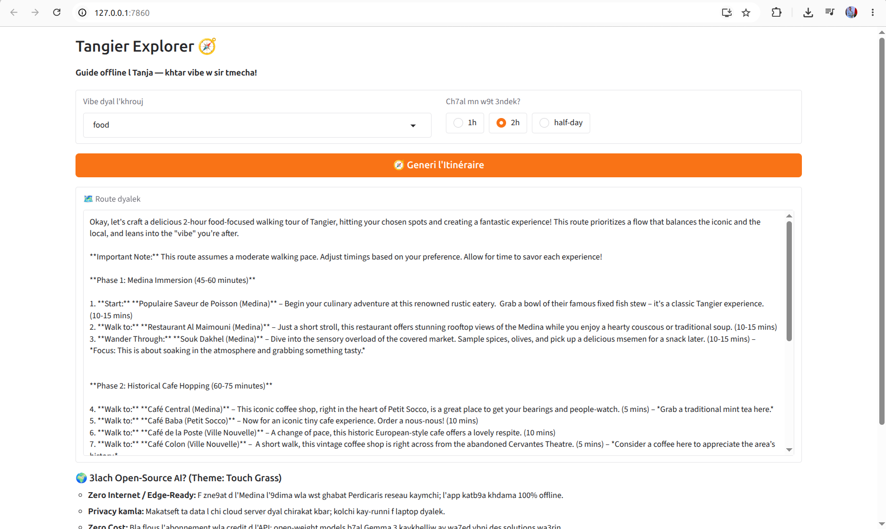
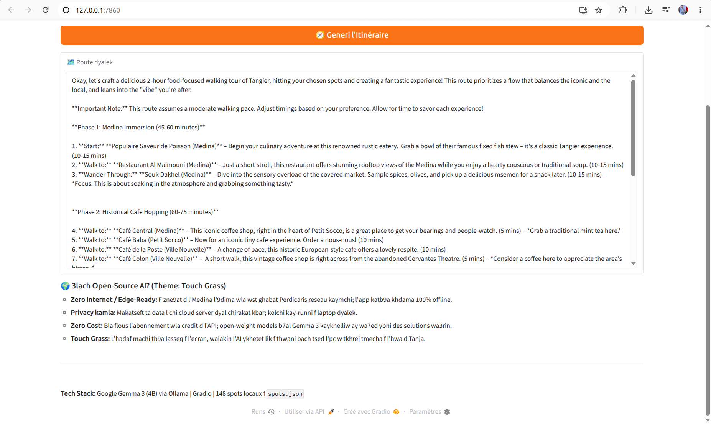

# Tangier Explorer

An offline AI walking-tour companion for Tangier, Morocco. Pick a vibe, pick a duration, and get a walking route narrated in Darija. No internet needed.

Built for the Hacktoberfest DEV Open-Source AI Challenge: Week 1 - theme "Touch Grass".

## Demo



## How it works

1. 148 real places in `spots.json` - landmarks, cafes, beaches, hidden spots, all verified by a local
2. Gemma 3 4B running locally via Ollama - no server, no internet, no cost
3. The user picks a vibe (history, food, hidden, sea, nature, culture) and a duration (1h, 2h, half-day)
4. Gemma orders the spots into a walking route and narrates them in Darija

The model is small, so the architecture is honest: the data is the source of truth, Gemma is the storyteller. No hallucinations, no fake places.

## Run it

```bash
ollama pull gemma3:4b
python3 tangier_explorer.py
```

Then open http://127.0.0.1:7860 in your browser. Pick a vibe and go for a walk!

## Why open-source AI?

- Offline: works in the mountains and in the Kasbah alleys with zero signal
- Private: your data never leaves your laptop
- Free: no API bills, no subscriptions
- Yours: swap the model, tweak the prompt, add your own city

## Project structure

- `tangier_explorer.py` - the Gradio app
- `spots.json` - 148 verified places in Tangier

## License

MIT
